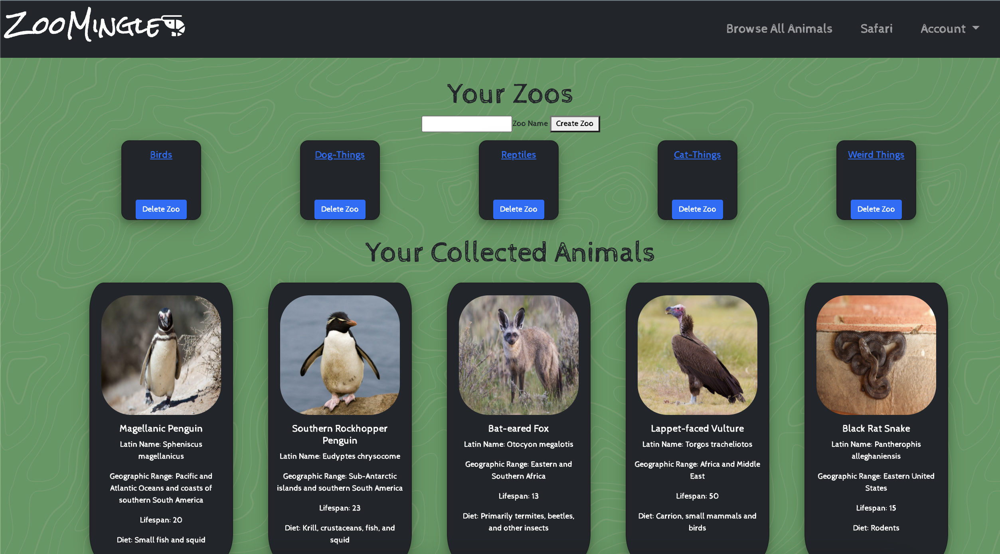

<h1>ZooMingle!</h1>

<h2><strong><a href="https://zoomingle.herokuapp.com/">Visit here!</a></strong></h2>

<h2>What is it?</h2>

Zoomingle is a web application where you can collect randomly selected animals in a tinder-akin fashion and then assign those animals to zoos of your choosing!

<h2>What can I do?</h2>

Users can have unique zoos filled with a variety of creatures that are unlikely to very similar with other users. Eventually, users will be able to trade these animals with others and form unique collections with all their favorite animals to show-off to others!

<h2>
<a href="https://trello.com/b/M9hHGHsy/zoomingle">Trello Planning</a>
</h2>

<h2>Technologies used: 💻</h2> 
<ul>
<li>Node.js</li>
<li>Express</li>
<li>EJS</li>
<li>Mongoose</li>
<li>Passport</li>
<li>Bootstrap</li>
<li>Hammer.js</li>
<li>Font Awesome Icons</li>
</ul>

<h2>Credits: 🙌</h2>
<ul>
<li>Zoo Animal API used from <a href="https://zoo-animal-api.herokuapp.com/">https://zoo-animal-api.herokuapp.com/</a></li>
<li><a href="https://codepen.io/RobVermeer/pen/japZpY">Tinder animations by Rob Vermeer</a></li>
</ul>

<h2>Planned Icebox Features🧊</h2>

- [ ] Add ability for users to see other user's zoos
- [ ] Add ability to trade animals with others
- [ ] More animations and sound effects, overall CSS overhaul
  - [ ] Background effect on login page
- [ ] Limit users on animals so that animals are more unique to each person.
- [ ] More zoo customization
  - [ ] Give animals names
  - [ ] Give zoos a profile picture
  - [ ] Reorganize animals
  - [ ] Limit animals to only 1 zoo/user
- [ ] Accessibility features: light/dark mode, mobile responsiveness